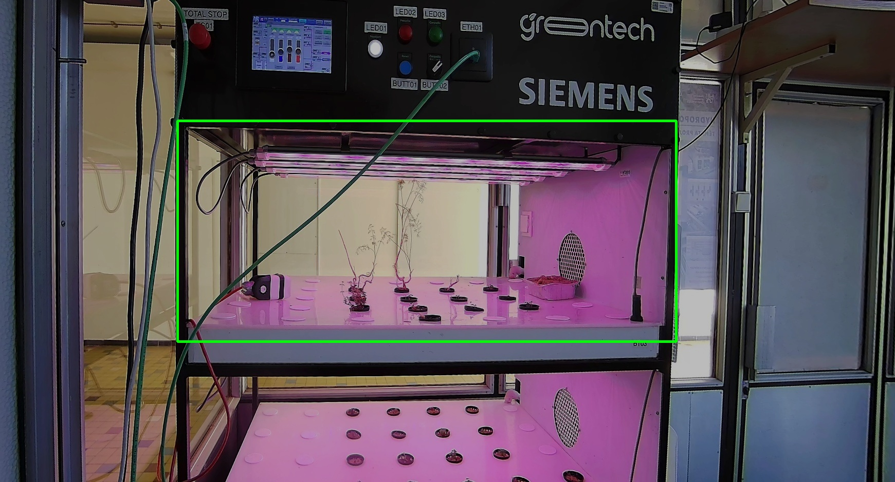

# Assignment: Robust Detection of the Upper Shelf in Hydroponics

## Task
Create an automatic algorithm that **detects and crops**
(show bounding box) the upper shelf from each image in `input_images/`.
Example image annotated with bounding box follows:

Your method must:

- work **fully automatically** for all 9 images,
- **must not** use any hard-coded coordinates or image-specific thresholds,
- be **robust** to lighting changes, blur, occlusions, rotations, and distortions,
- produce for each input image:
  - a visualization with the detected region (bounding box or mask),
- work also for similar images that are not present currently (your method should generalize well)

Use any techniques learned in previous lessons.

## Dataset
- You are provided with a fixed set of **9 images** in the folder `input_images/`.
Additionally, a script **`check_output.py`** is provided.  
- Run it to visualize how the **correct bounding boxes** look on the images.  
This serves only as *reference* — your algorithm must **not** use these coordinates directly.

## Requirements
- Implement your solution in **Python**.  
- Process all 9 images in a **loop**, no manual fine-tuning.  
- Show the results:
  - `detection_*` – images with detected region visualized
- Compare your crops with the ground-truth bounding boxes in script `check_output.py`.
- Show *your bounding box* (red color) and the *ground truth bounding box* (green color) in a single `matplotlib` figure for every image.  

## Expected Submission
- 9 detection visualizations  
- A short discussion including:
  - how your detection method works,
  - robustness, successes, failures,
  - how you ensured **no fixed coordinates** were used
- Source code

## Hint
Inspect the dataset using `check_output.py` to understand what the shelf region looks like.  
